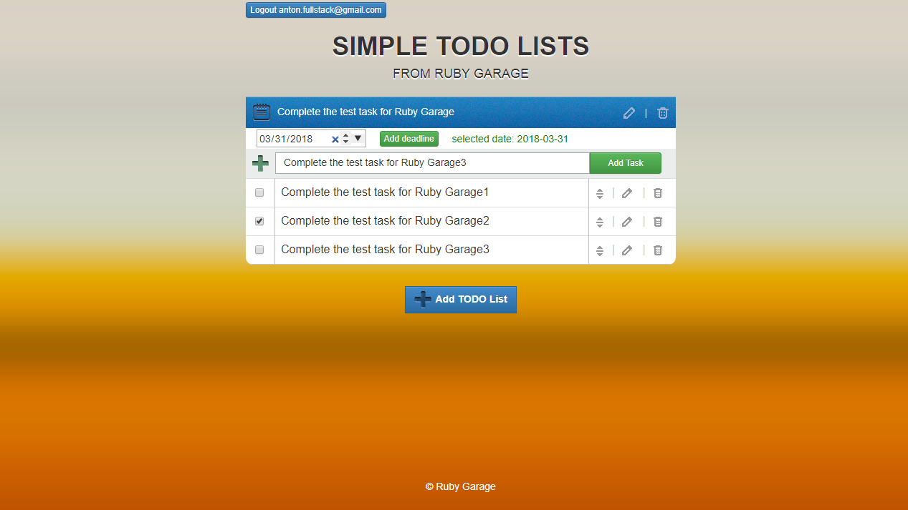

## Технологии при реализации

Angular JS + самописный PHP framework

demo: http://q96698wz.bget.ru/

"Write the queries for" в папке db файл SQL-task.sql

# Иллюстрация

## Запуск проекта локально

Для запуска на локальном сервере с собственной базой:
1. Создать базу данных и пользователя с паролем в MySQL
2. Сделать импорт таблиц из дампа(файла в папке db) garage-todo.sql в созданную базу
3. В "config\config.php" в конструкторе класса прописать параметры подключения к БД

При удачном подключении к базе данных на сервере с проектом станут доступными:
- Публикация комментария (при смайл символах они будут заменены на соответствующие анимированные изображения)
- Просмотр комментариев
- Удаление комментария

# Установка PHPUnit.

С официального сайта https://phar.phpunit.de/ была была скачана версия phpunit-4.8.9.phar

На Windows 
1. Перейти в каталог с PHP.exe, например у меня на OpenServere:
C:\OpenServer\modules\php\PHP-5.5

2.Создать файл phpunit.bat в данном каталоге, чтобы получить доступ к phpunit из любой папки (например из корня своего приложения),
а не только находясь в папке с php куда он установлен: пишем в него @php "%~dp0phpunit-4.8.9.phar" %*

3.Проверим появился ли доступ:
phpunit --version

## Task manager

I'm a person who passionate about my own productivity. I want to manage my tasks
and projects more effectively. I need a simple tool that supports me in controlling my
task-flow

<h4>Functional requirements</h4>

★ I want to be able to create/update/delete projects

★ I want to be able to add tasks to my project

★ I want to be able to update/delete tasks

★ I want to be able to prioritize tasks into a project

★ I want to be able to choose deadline for my task

★ I want to be able to mark a task as 'done'

<h4>Technical requirements</h4>

★ It should be a WEB application

★ For the client side must be used: HTML, CSS (any libs as Twitter Bootstrap,
Blueprint ...), JavaScript (any libs as jQuery, Prototype ...)

★ For a server side any language as Ruby, PHP, Python, JavaScript, C#, Java ...

★ It should have a client side and server side validation

★ It should look like on screens (see attached file ‘rg_test_task_grid.png’).

<h4>Additional functionality</h4>

★ It should work like one page WEB application and should use AJAX technology, load
and submit data without reloading a page.

★ It should have user authentication solution and a user should only have access to
their own projects and tasks.

★ It should have automated tests for the all functionality
SQL taskGiven tables:

★ tasks (id, name, status, project_id)

★ projects (id, name)

<h4>Write the queries for:</h4>

1. get all statuses, not repeating, alphabetically ordered

2. get the count of all tasks in each project, order by tasks count descending

3. get the count of all tasks in each project, order by projects names

4. get the tasks for all projects having the name beginning with “N” letter

5. get the list of all projects containing the ‘a’ letter in the middle of the name, and
show the tasks count near each project. Mention that there can exist projects without
tasks and tasks with project_id=NULL

6. get the list of tasks with duplicate names. Order alphabetically

7. get the list of tasks having several exact matches of both name and status, from
the project ‘Garage’. Order by matches count

8. get the list of project names having more than 10 tasks in status ‘completed’. Order
by project_id
